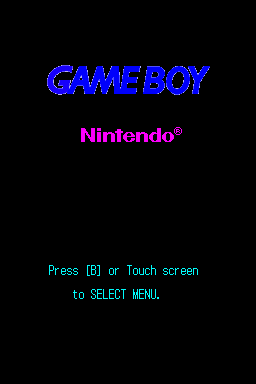
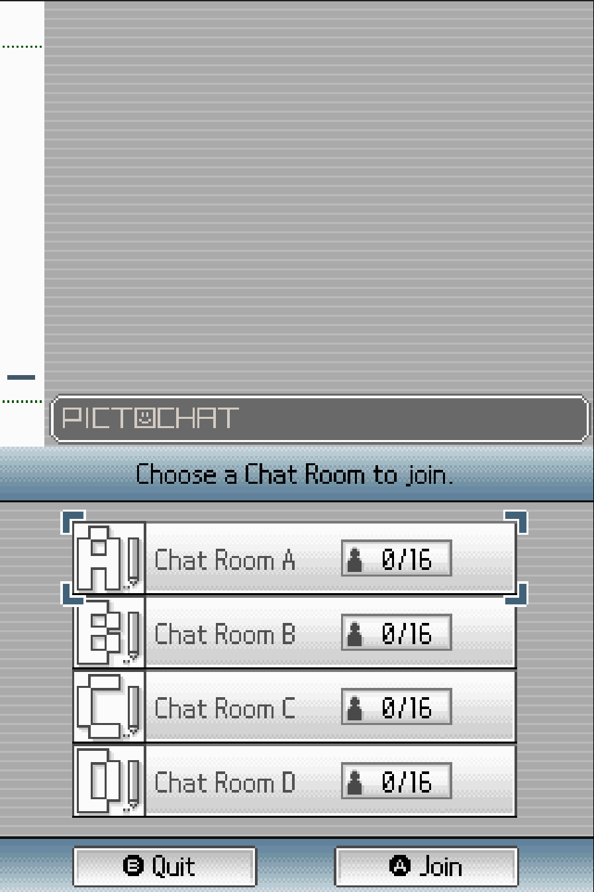
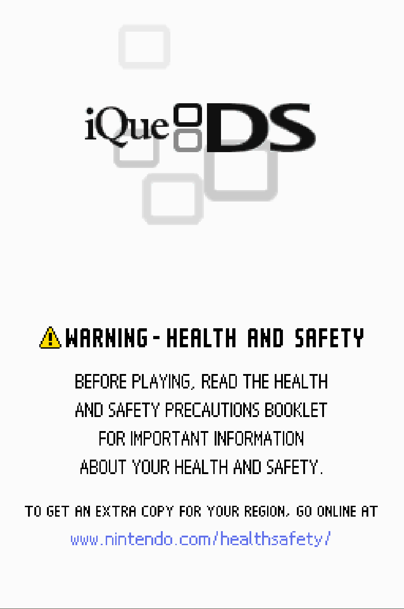

# DS-Firmware-Archive
Full collection DS Firmware, BIOS

This repository is for educational and preservation purposes only. All copyrights belong to Nintendo Co., Ltd.

## Content
- [040615](#040615)
- [40820D](#40820D)
- [v1](#v1)
- [v2](#v2)
- [v3](#v3)
- [iQue DS](#iQueDS)
- [v4](#v4)
- [v5 Beta](#v5Beta)
- [v5](#v5)

### 040615
DS Prototype 040615 (E3 Era)

- Build Date: June 15, 2004 (2004-06-15)
- File release date: November 24, 2022 (2022-11-24)
- Status: Found. Ultra-rare Early Prototype.
- Released by: Nintendo, Found: Forest of Illusion
- Information: One of the earliest known firmware builds. This version dates back to the time of E3 2004.

  

### 40820D
DS Prototype 40820D (X4)

- Build Date: August 20, 2004 (2004-08-20)?
- File release date: July 30, 2022 (2022-07-30)
- Status: Found. Ultra-rare Pre-launch Prototype (X4 Hardware Revision)
- Released by: Nintendo, Found: Forest of Illusion
- Information: The earliest (after 040615) firmware version known to us at the moment has fundamental differences from the release.

  

### v1

DS Release V1

- Build Date: October, 2004 (2004-10)
- Status: Found. Rare.
- Released by: Nintendo
- Information: It was released in the first days of DS sales. When you remove the cartridge from PictoChat, it simply freezes.

  

### v2

DS Release V2

- Build Date: Late November, 2004 (2004-11)
- Status: Found. Rare.
- Released by: Nintendo
- Information: Some bugs have been fixed. When removing the cartridge from PictoChat, the screen turns grey-blue.

  

### v3

DS Release V3

- Build Date: February, 2005 (2005-02)
- Status: Found. Rare.
- Released by: Nintendo
- Information: Some bugs have been fixed. When removing the cartridge from PictoChat, the screen turns dark-green.

  

### iQueDS

DS China Release V3

- Build Date: Spring, 2005 (2005)
- Status: Found. Super-Rare.
- Released by: Nintendo (iQue)
- Information: Modified version v3. When removing the cartridge from PictoChat, the screen turns dark-green. Chinese language was added (hence the size of 512 KB). Nintendo logo changed to iQue.

  

### v4

DS Release V4

- Build Date: Summer, 2005 (2005)
- Status: Found. Common.
- Released by: Nintendo
- Information: Some bugs have been fixed. When removing the cartridge from PictoChat, the screen turns yellow.

  

### v5Beta

DS Release V5 Beta

- Build Date: November, 2005 (2005-11)
- Status: Found. Ultra-Rare.
- Released by: Nintendo
- Information: Some bugs have been fixed. When removing the cartridge from PictoChat, the screen turns magenta. DS Fat v5 Beta version.

### v5

DS Release V5

- Build Date: December, 2005 (2005-12)
- Status: Found. Common.
- Released by: Nintendo
- Information: Some bugs have been fixed. When removing the cartridge from PictoChat, the screen turns magenta. DS Fat v5 version.

  

